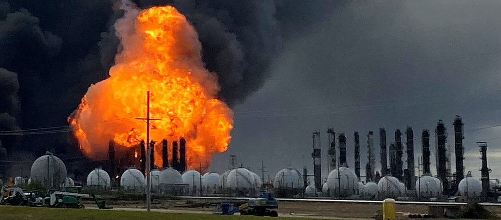
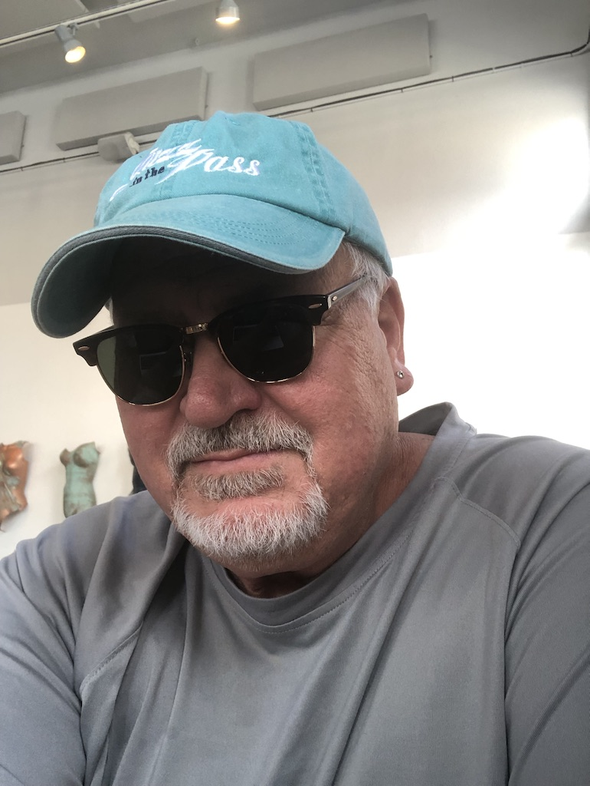

# Institute for Public Awareness and Understanding of Hazardous Technology Risks

*Engineering research and education dedicated to developing and sustaining an informed electorate.*

## Mission

The *Institute for Public Awareness and Understanding of Hazardous Technology Risks* is a non–profit engineering research and education outreach organization focused on making safety-critical protections and their regulatory oversight more understandable by the public. Voters who are well informed with respect to hazardous technology risks and regulatory oversight are better able to make choices at the ballot box that will reflect their personal values. The *Institute’s* leadership holds that facilitating information symmetry is the most effective means of mitigating publicly-held moral hazard. Publicly held risk and regulatory policy should not be veiled by impenetrable engineering jargon. To this end, the *Institute* frames information about hazardous technology risks and regulatory protections using principles of engineering, science, mathematics, and economics that are made approachable and layman-digestible. A risk-informed electorate will hold accountable the politicians responsible for guiding the policies and regulatory affairs intended to protect the public.

The *Institute’s* research and education activities are offered as public service and are politically agnostic. 

## Activities

The *Institute* delivers technical education, risk–analytic research, and editorial commentary specific to the publicly–held risks associated with hazardous technologies.

Education outreach is delivered through seminars, workshops and short–courses offered to civic organizations, professional societies, political staffs, secondary schools, and universities. All instruction is presented in an audience–interactivity setting, with supplemental materials designed to be congruent with the audience level of technical expertise and prior exposure to principles of risk assessment. Additionally, the *Institute* maintains directed reading lists and case studies supporting its education outreach activities. The *Institute* also actively partners with with higher education through student internships.

Original research results developed by *Institute* affiliates are documented in the public domain peer–reviewed journals and proceedings specific to hazardous technology, safety–critical protections, risk analytics, reliability engineering, and engineering economic analysis.

*Institute* Co-Directors, Fellows, and Interns publish editorial commentary in public media specifically focused on hazardous technology risk awareness and risk understanding. Such editorials include critiques of previously reported research and practice of risk–analytic methods applied to hazardous technologies and responses to invitations for public comment by regulatory agencies and legislative forums.

## Institute Co-Directors

**Marty Wortman** joined the *Institute* following more than 35 years in engineering academia. He is a leading authority on reliability, risk, and technology assessment, with particular emphasis on production operations. He has served as consultant to federal agencies and departments including NSF, DoE, DoD, OSD as well as industry. He is widely recognized for his research and teaching on predictive probability modeling, connecting operational physics with economic outcomes. He has authored numerous research publications, technical reports and instructional portfolios, and he has served on the editorial boards of leading journals in his field, In his spare time, Marty is an enthusiastic angler.

wortman@haztechrisk.org

**Ernie Kee** brings to the *Institute* over 40 years of engineering experience.  He is recognized for his work developing industry applications focused on regulatory compliance, risk assessment, and emergency operations support. His industrial experience includes positions as unit nuclear reactor engineer, and engineering technical advisor to nuclear operations management, He organized and managed the technical team responsible for experimental research and computer simulation to assess nuclear facility risk exposure. Additionally, he has worked extensively in experimental design and analysis supporting development and validation of mainframe scale commercial and DoE-sponsored computer simulation in the US and abroad. He has held research appointments with the Idaho National Laboratory and Texas A&M University. He is author of numerous research publications and has taught courses in probabilistic risk assessment methods and engineering ethics. Ernie is a veteran of the U. S. Navy Submarine Service. 

kee@haztechrisk.org

